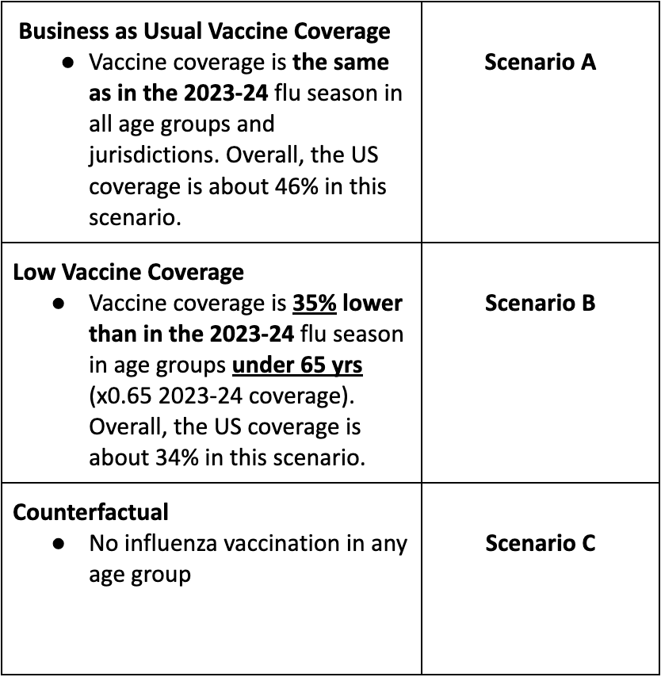

# Flu Scenario Modeling Hub

Last updated: 2025-04-17.

## Previous Round Scenarios and Results:

<https://fluscenariomodelinghub.org/viz.html>

Previous rounds (round 1 to round 1 of 2024-2025 (round 5)) are available in the 
[Flu Scenario Modeling Hub - Archive](https://github.com/midas-network/flu-scenario-modeling-hub_archive) 
GitHub Repository

## Rationale

Even the best models of infectious disease transmission struggle to give 
accurate forecasts at time scales greater than 3-4 weeks due to unpredictable 
drivers like changing policy environments, behavior change, development of new 
control measures, and stochastic events. However, policy decisions around the 
course of infectious diseases, particularly emerging and seasonal infections, 
often require projections in the time frame of months. The goal of long-term 
projections is to compare outbreak trajectories under different scenarios, as 
opposed to offering a specific, unconditional estimate of what “will” happen. 
As such, long-term projections can guide longer-term decision-making while 
short-term forecasts are more useful for situational awareness and guiding 
immediate response.

We have specified a set of scenarios and target outcomes to allow alignment of 
model projections for collective insights. Scenarios have been designed in 
consultation with academic modeling teams and government agencies (e.g., CDC).

This repository follows the guidelines and standards outlined by the 
[hubverse](https://hubverse.io), which provides a set of data formats
and open source tools for modeling hubs.

## How to participate

The Flu Scenario Modeling Hub is open to any team willing to provide projections
at the right temporal and spatial scales, with minimal gatekeeping. We only 
require that participating teams share point estimates and uncertainty bounds, 
along with a short model description and answers to a list of key questions 
about design. A major output of the projection hub is ensemble estimates of 
epidemic outcomes (e.g., infection, hospitalizations, and deaths), for different
time points, intervention scenarios, and US jurisdictions.

Those interested to participate, please read the README file and email
us at
[scenariohub\@midasnetwork.us](mailto:scenariohub@midasnetwork.us).

Model projections should be submitted via pull request to the
data-processed folder of this GitHub repository. Technical instructions
for submission and required file formats can be found
[here](./model-output/README.md).

## Influenza Round 1 2025-26: Vaccine Coverage - Vaccine impact and pre-season projections for the 2025-26 season

The primary goal of Round 1 of 2025-26  is to evaluate the impact of flu 
vaccination in light of plausible trajectories and disease burden for the 
upcoming season. A secondary goal is to provide pre-season projections for the 
upcoming influenza season at a time when flu activity is low, similarly to 
prior influenza rounds. We will consider a single scenario axis related to 
vaccine coverage, while all the epidemiological uncertainty will be collapsed 
and left at teams’ discretion. Projections will run over a 43-week period, from 
Sun Aug 10, 2025 to Sat June 6, 2026. Unlike prior years, we will consider 
counterfactual no–vaccination scenarios, which will allow estimation of the 
direct and indirect benefits of vaccination in different age groups. Scenarios 
will follow a 3\*1 structure:

#### Uncertainty regarding influenza epidemiology:

**This year, we leave all uncertainty regarding influenza epidemiological 
parameters at teams’ discretion. This includes pre-existing immunity at the 
start of the season, transmissibility, seeding, antigenic novelty, subtype 
dominance, seasonality and behavioral effects.** 

**Teams should consider a large range of parameter uncertainty that is both 
consistent with the long-term behavior of influenza (eg, the last ~20 years of 
disease burden, timing, and effective transmissibility) and the recent past 
(ie, the amount of immunity accumulated in the last season, or recent seasons 
if relevant).** Teams can calibrate their model to a range of historical 
influenza epidemics for multiple past seasons (eg, [dashboard of past seasons’ impacts](https://www.cdc.gov/flu-burden/php/data-vis/past-seasons.html)), 
or rely on relevant [publications](https://www.pnas.org/doi/pdf/10.1073/pnas.1415012112). 
For teams looking for guidance, the maximum Re for seasonal flu has ranged 
between 1.1 and 1.4 in recent years. Conceptually, transmissibility at the 
start of the season includes the effect of prior immunity accumulated in past 
seasons and antigenic change in viruses ultimately circulating in 2025-26. 
Both of these mechanisms can generate large intensity seasons. For models that 
consider antigenic changes, any simulated antigenic change should be consistent 
in both probability and magnitude with observations from past seasonal 
influenza epidemics (all subtypes combined).

A primary question of interest in this round is to contrast the impact of 
vaccination in seasons with a high or low disease burden (as more 
hospitalizations and deaths will theoretically be averted in a large flu 
season). As a result, we intend to analyze vaccine effects by splitting 
individual simulations by high and low total epidemic sizes (based on 
counterfactual scenario C). By considering the shape of individual simulations, 
we can also assess the differential effects of vaccination for earlier and 
later epidemics, and any other aspect of influenza epidemiology that may 
interact with vaccination impact (eg, age distribution of hospitalizations etc). 

Teams can use their best scientific judgment to define severity (ie, 
hospitalization risk given infection, or infection fatality risk) based on 
past seasons.

The seasonal trends, timing, weekly trajectory and age distribution of the 
projected 2025-26 season are at teams discretion. These features are expected 
to come from model assumptions, for instance from prior immunity, seeding, or 
contacts.

Teams who rely on subtype-specific flu models can assume any subtype dominance 
or co-dominance patterns in 2025-26.

**We ask that teams include assumptions regarding Re, pre-existing immunity, 
and antigenic changes (or related parameters), seasonality, and severity in 
the meta-data abstract. We will also calculate Re a posteriori from the 
individual simulations for further analyses. To further facilitate comparison 
between models and individual simulations, we also request that teams tag each 
trajectory by the all-age immunity proportion (total individuals partially 
immune/total population size) on Oct 1, 2025.**

#### Calibration to past seasons:

To calibrate epidemiologic patterns to past seasons, teams can use a variety of 
datasets (eg, ILI, % positive for influenza, FluSurv-NET hospitalizations, 
NHSN etc) to estimate quantities that will inform their model. Information 
about the epidemiology of the 2024-25 season can be found 
[here](https://www.cdc.gov/acip/downloads/slides-2025-06-25-26/03-dugan-influenza-508.pdf) 
and [here for earlier seasons](https://www.cdc.gov/flu-burden/php/data-vis/past-seasons.html).

Recall that with the above published end-of-season summary estimates, the 
hospitalization burden is corrected for underreporting and should not be used 
for direct estimation of hospitalizations as would be reported to HHS 
Protect/NHSN. Using the data provided in the above links is fine to estimate 
age distribution and relative severity of different seasons. 

FluSurv-NET is an influenza hospitalization surveillance network that collects 
data on laboratory-confirmed influenza-associated hospitalizations through a 
network of acute care hospitals in a subset of states (14 as of August 2023). 
Age-specific weekly rates per 100,000 population are reported in this system. 
Note that for most states participating in FluSurv-NET, only a fraction of the 
state population is represented in surveillance. However, for teams who prefer 
counts rather than rates for calibration, state population sizes can be used to 
approximate hospital admission counts based on the observed rates. Additional 
details on interpreting FluSurv-NET data are available at 
[Influenza Hospitalization Surveillance Network (FluSurv-NET)](https://www.cdc.gov/flu/weekly/influenza-hospitalization-surveillance.htm)

#### Vaccination axis: 

**Assumptions regarding vaccine effectiveness:** 
In all scenarios, we will use an all-age VE of **50% against medically attended 
influenza illnesses and hospitalizations**, in line with the average VE 
reported in recent seasons. We assume that VE against hospitalizations and 
medical illnesses is the same. Teams who have developed age-stratified models 
can consider age differences in VE; in this case, these age-specific VE should 
apply to all scenarios A-C.  

The 50% VE assumption should be considered as directly applicable to the 
2025-26 season, even though the exact mix of circulating subtypes (particularly 
how much flu B may circulate) may differ from recent seasons. Relatedly, if 
teams assume a probability of antigenic change as part of their uncertainty 
range, the effective VE for an antigenically advanced strain should be 
maintained at 50% against hospitalizations and medically attended illnesses. 
In other words, this assumes that the vaccine would remain well matched, even 
if there was an antigenic change. 

As previously, assumptions about VE against infection and transmission are at 
teams’ discretion, but we provide guidelines. In general, teams should be 
assuming a lower VE against infection and transmission than against 
hospitalization or medically attended illness. For instance, a recent household
transmission study found that the overall VE for preventing secondary infections 
among household contacts was 21.0% (1.4%, 36.7%) and varied by 
[influenza type](https://jamanetwork.com/journals/jamanetworkopen/fullarticle/2826553). 
In addition, a [community study from 2010-11](https://pubmed.ncbi.nlm.nih.gov/23413420/) 
reports an adjusted VE of 31% (-7-55%) against community-acquired influenza 
infection, which includes mild and transient illnesses.

**Assumptions regarding VE impact on infection and transmission should be 
reported in the abstract meta-data.**

#### Vaccination coverage assumptions:

We have provided weekly state-level coverage to use in **scenarios A-B** 
[here](https://github.com/midas-network/flu-scenario-modeling-hub_resources/blob/main/Rd1_datasets/Age_Specific_Coverage_Flu_RD1_2022_23_Sc_A_B_C_D.csv) 
for age groups: 0-4 yr, 5-12 yr, 13-17 yr, 0-17 yr, 18-49 yr, 50-64 yr, 65+ yr. 
Projected coverage for scenarios A-B are based on vaccination rates reported in 
2023-24, which is the most recent complete year of vaccination data. We provide 
cumulative coverage curves for business as usual scenarios (A: same coverage as 
in 2023-24), with 35% correction down in individuals under 65 yrs to match 
scenario B assumptions. The 35% reductions have been applied to each 
jurisdiction and age group under 65 yrs for scenario B. I.e., if Alabama 
reported 50% coverage in age group 18-64 in 2023-24, the assumed coverage in 
this age group is 50% in scenario A and  50\*0.65=32.5% in scenario B. The 
timing of vaccination and relative differences between age groups and states 
will proceed similarly to past years, which has been taken into account in the 
vaccination file that we provide for the 2025-26 season. In summary, coverage 
data in this file can be used as is, without further adjustment. 

**Unlike prior years, we are now considering a hypothetical counterfactual 
scenario, scenario C, where vaccination coverage should be set to 0% in all 
age groups and jurisdictions.**

#### Pairing:

Simulations should be paired across all 3 scenarios, i.e. simulations from 
scenarios A-B-C should be paired using all parameters affecting disease 
dynamics (i.e. same initial immunity conditions, Re, IFR, IHR, behavior, and 
any other relevant disease parameters), with the only difference being vaccine 
conditions. 

#### Timeline:

**ROUND 1 FLU 2025-26**

- **Scenarios set (no changes after):** *Friday, Aug 1, 2025*
- **Projections due:** *Friday, Sep 5, 2025*
- **Report finalized:** *No later than Friday, Sep 12, 2025*

### OTHER SPECIFICATIONS AND ASSUMPTIONS

#### Prior Immunity

- Prior immunity is at teams’ discretion. 
- Prior influenza immunity is assumed to be a combination of residual immunity 
  from previous infections and previous seasonal vaccinations. The exact 
  specifications of prior immunity are left at the discretion of each team, 
  and will depend on model specification, but we provide suggestions below. 
- At the onset of a typical influenza season (all subtypes combined), modeling 
  has estimated that around 30-35% of the population has prior immunity 
  (65-70% susceptible), the effective reproduction number ranges from 1.2-1.4, 
  and the attack rate (final size) is between 8-25%, 
  [Yang et al, 2015](https://www.pnas.org/doi/pdf/10.1073/pnas.1415012112). 
  The 2009 pandemic, which was marked by the emergence of a new strain to which 
  individuals under the age of 50 yrs were susceptible, was associated with 
  greater transmission (cumulative attack rates 32% over 2009) and decreased 
  prior immunity compared to a regular season (prior immunity in 2009 is ~25% 
  instead of ~33%).
- Teams are allowed to vary prior immunity by virus subtype, age or other 
  demographic characteristics, and state. Teams should plan to include these 
  assumptions in their abstract metadata.
  
#### COVID-19 Interactions

- No major interactions with future COVID-19 surges (immunological, social, 
  behavioral) should be considered in this round. 
  
#### Influenza strains

- Hospitalization and death targets include the impact of all influenza 
  subtypes combined. Weekly surveillance updates can be found 
  [here](https://www.cdc.gov/flu/weekly/index.htm).
- Subtype-specific models are allowed, and we do not make any assumptions about 
  the particular subtype(s) circulating in 2025-26.

#### Vaccine immune waning

- Vaccine-induced immunity has been found to decrease rapidly over the course 
  of an influenza season, 
  [Ferdinands et al, 2017](https://academic.oup.com/cid/article/64/5/544/2758477?login=true)

#### Age groups

- Age-stratification is required. 
- Age-strata:
    - Required overall population `0-130`
    - `0-4`, `5-17`, `18-49`, `50-64`, and 65+ (`65-130`). Most of the burden 
      on hospitalization and deaths come from the 0-4 and 65+ age groups.

#### Projection Period

- Sun Aug 10, 2025 to Sat June 7, 2026 (43 weeks)

#### Targets

In this round, we will **require submission of 300-600 individual trajectories 
for each target while submission of quantiles is optional**. As a result, 
the only required targets for trajectories will be weekly incident 
hospitalizations and weekly deaths. Estimates of cumulative counts can be 
obtained from weekly trajectories and hence we do not require trajectories 
for cumulative counts. Similarly peak targets (peak hospitalization magnitude 
and peak timing) can be reconstructed from weekly trajectories. Teams who wish 
to submit quantiles along with trajectories should provide quantiles for weekly 
and cumulative counts, as well as for hospitalization peak size and peak timing. 

We require that simulations are paired across time, geography, age group, 
targets (deaths, hospitalizations, etc.) and vaccine coverage levels. Any 
trajectory from scenario A should have a matched trajectory in scenarios 
B and C. Information on pairing structure will be gathered at the submission 
stage.

Each trajectory should be tagged by the proportion of susceptibles on Oct 1, 
2025. This information should be provided at submission as an additional target.

##### Weekly target

- Weekly reported state-level incident hospitalizations, will be based on the 
  HHS/NHSN COVID and flu 
  [NHSN Weekly Hospital Respiratory Dataset](https://data.cdc.gov/Public-Health-Surveillance/Weekly-Hospital-Respiratory-Data-HRD-Metrics-by-Ju/ua7e-t2fy/about_data). 
  This dataset has previously been updated daily and covers 2020-2025. Weekly 
  hospitalizations should be based on the 
  “previous_day_admission_influenza_confirmed” variable, without any adjustment 
  for reporting (=raw data from NHSN dataset to be projected). A current 
  version of the weekly aggregated data 
  [has been posted here](https://github.com/midas-network/flu-scenario-modeling-hub_resources/blob/main/Rd1_datasets/HHS_flu_2020_2022_dataset.csv). 
  Note that the dataset was paused May-Nov 2024 so this period has notoriously 
  low reporting.
- Weekly national incident deaths, from the CDC multiplier model (i.e., true 
  mortality burden from the pyramid). These are real-time model estimates 
  updated weekly during the influenza season.  The model relies on influenza 
  deaths reported in the hospitals via the FluSurv-NET system, adjusted for 
  under testing of flu in the hospital and the proportion of deaths occurring 
  outside of the hospital. There is no state detail. Preliminary estimates from 
  the CDC burden model suggest that between October 1, 2023 - June 15, 2024, 
  between 25,000 – 74,000 deaths were due to flu illness or flu-related 
  complications, while these numbers are 27,000-130,000 for the 2024-2025 
  season. We have provided several historical seasons of weekly death estimates 
  for [calibration](https://github.com/midas-network/flu-scenario-modeling-hub_resources/blob/main/Rd1_datasets/In-season-National-Burden.csv) 
  from 2018-19 to 2024-25. Further, see 
  [here](https://www.cdc.gov/flu/about/burden/preliminary-in-season-estimates.htm) 
  for summary estimates for past seasons. 
- No case target
- No infection target
- All targets should be numbers of individuals, rather than rates.

###### Optional targets

- Additional incidence target based on ED visits: Weekly reported state-level 
  incident ED visits for influenza 
  ([NSSP dataset](https://data.cdc.gov/Public-Health-Surveillance/NSSP-Emergency-Department-Visit-Trajectories-by-St/rdmq-nq56/about_data)). 
  This dataset covers 2022-present. Weekly hospitalizations should be based on 
  the “percent_visits_influenza” variable. Note that this is a relative 
  indicator of incidence, ie total ED visits for flu divided by total ED visits. 
  Data broken down by age groups are graphed 
  [here](https://www.cdc.gov/fluview/surveillance/2025-week-24.html#cdc_data_surveillance_section_2-outpatient-and-emergency-department-illness-surveillance).
-  Additional targets if submitting quantiles in addition to trajectories:
    - Cumulative hospitalizations. Cumulative outcomes start at 0 at the start 
      of projections, on Aug 10, 2025. This is similar to prior influenza rounds. 
    - State-level peak hospitalizations.
    - State-level timing of peak hospitalizations.

##### State-level variability

- Vaccination coverage, age population. Variability in the age distribution of 
  hospitalizations between states is allowed as long as it aggregates to the 
  scenario definition for the US overall (population weighted average). 
- Variability in severity between states is possible.
- Prior immunity (due to a combination of vaccination and natural infection) 
  can be the same or vary between states.

##### Cross-protection between subtypes

- At the discretion of the teams.

##### Seasonality

- Teams should include their best estimates of influenza seasonality in their 
  model but we do not prescribe a specific level of seasonal forcing.

##### NPI 

- No reactive NPIs to COVID-19 or influenza in this round; low level masking 
  allowed at groups’ discretion.

##### Seeding of influenza

- We leave seeding intensity, timing and geographic distribution at the 
  discretion of the teams. In addition to the HHS hospital dataset, the 
  [flu portal dashboard](https://gis.cdc.gov/grasp/fluview/fluportaldashboard.html) 
  is a good resource for state-specific information on strain 
  circulation and epidemic intensity (e.g., weekly % positive, or weekly 
  ILI\*%positive), and can be used to adjust seeding.

##### Initial Conditions

- The mix of circulating strains at the start of the projection period is at 
  the discretion of the teams based on their interpretation of the scenarios 
  and best scientific judgement. Variation in initial prevalence between states 
  is left at teams’ discretion. 

**All of the teams’ specific assumptions should be documented in meta-data and 
abstract.**

### Submission Information

| Scenario  | Scenario name  | Scenario ID for submission file ('scenario_id') |
|---------------------------------|:-----------------:|:-----------------:|
| Scenario A. Business as usual vaccine coverage | usualVax | A-2025-07-29 |
| Scenario B. Low vaccine coverage               | lowVax   | B-2025-07-29 |
| Scenario C. Counterfactual no-vaccine          | noVax    | C-2025-07-29 |

- **Due date**: Friday Sep 5, 2025
- **End date for fitting data**:  Between Saturday July 5, 2025 and Saturday 
  Aug 9, 2025
- **Start date for scenarios**: Sunday Aug 10, 2025 (first date of simulated 
  transmission/outcomes)
- **Simulation end date:** Saturday June 6, 2026 (43-week horizon)
- Desire to release results by early September 2025

#### Other submission requirements

- Simulation trajectories: We ask that teams submit a sample of at least 300 
  simulation replicates, paired across vaccination levels. Simulations should 
  be sampled in such a way that they will be most likely to produce the same 
  summary statistics as that quantile submitted. For some models, this may mean 
  a random sample of simulations, for others with larger numbers of 
  simulations, it may require weighted sampling. 
  We also require that each trajectory should be tagged by the proportion of 
  susceptibles on Oct 1, 2025.
- Geographic scope: state-level and national projections
    - All states not required, US overall recommended.
- Results: 
    - Summary: Results must consist of a subset of weekly targets listed below;
      all are not required. Weeks follow epi-weeks (Sun-Sat) dated by the last 
      day of the week. 
    - **Weekly Targets** (subset of: hospitalizations, deaths)
        - Weekly incident 
- Metadata: We will require a brief meta-data form, from all teams.
- Uncertainty:
    - For trajectories (required submission): we require at least 300 
      trajectories.
    - For quantiles (optional submission) We ask for 0.01, 0.025, 0.05, every 
      5% to 0.95, 0.975, and 0.99. 

## Submitting model projections

Groups interested in participating can submit model projections for each
scenario in a PARQUET file formatted according to our specifications,
and a metadata file with a description of model information. See
[here](./model-output/README.md)
for technical submission requirements.

## Target data

The [target-data/](./target-data) folder contains the target data
in a hubverse compliant 
[time-series format](https://hubverse.io/en/latest/user-guide/target-data.html).

The data are automatically updated on Monday morning. The code to generate the
data is available in the [src](./src/) folder.
The past version of the `time-series` files are stored in the 
[auxiliary-data/target-data_archive](./auxiliary-data/target-data_archive/) 
folder, with the date the data was archived append to the filename.

### Hospitalization

Weekly Hospital Respiratory Data (HRD) Metrics by Jurisdiction from
the [NHSN Weekly Hospital Respiratory Dataset](https://data.cdc.gov/Public-Health-Surveillance/Weekly-Hospital-Respiratory-Data-HRD-Metrics-by-Ju/ua7e-t2fy/about_data) will be used for incidence hospitalization
target. The data are weekly. 

The target to be projected is confirmed influenza hospital admissions, reported 
as `Total Influenza Admissions`  or `totalconfflunewadm`. This is a total for 
the week running Sunday to Saturday. The same indicator is available for 6 
age groups (0-4, 5-17, 18-49, 50-64, 65-74 and 75+ (`numconfflunewadmped0to4`, 
`numconfflunewadmped5to17`, `numconfrsvnewadmadult18to49`, etc).

Influenza admission reporting became mandatory in this dataset on Feb-02-2021, 
and was until May 11, 2024. During May 11-Nov 2, 2024, reporting was paused 
and less than 75% of hospitals reported. Mandatory reporting resumed again on 
Nov 11, 2024. Accordingly, the data before February 2, 2021, and between May 
1-Nov 11, 2024, should be treated with caution.

Unlike flu admissions, flu deaths are no longer mandatory to report in this 
system and hence a different source of data will be used for deaths.

If teams need more refined age-specific hospitalization data for calibration, 
or a longer dataset, they can apply the age distribution of flu 
hospitalizations available in 
[Flusurv-NET](https://gis.cdc.gov/GRASP/Fluview/FluHospRates.html) to the 
all-age HHS rate. Flusurv-NET is CDC’s parallel and long-running hospitalization 
surveillance system, which is based on a smaller set of US hospitals (9%). We 
have provided state-specific time series 
[here](https://github.com/midas-network/flu-scenario-modeling-hub_resources/blob/main/Rd1_datasets/Flusurvnet_2003_2022_dataset.csv) (2003-present). 
Because Flusurv-NET data is not available for all states, we recommend that 
teams use the national age distribution of hospitalizations estimated in 
Flusurv-NET and apply it to national and state-specific HHS data. Adjustment 
for demographic differences between states can be considered, but are not 
required.

Earlier analyses have shown that influenza hospitalization estimates are 
consistent between the NHSN and FluSurvNET surveillance systems in areas where 
both systems overlap. Further the ED data is also well correlated with the other 
two hospitalizations indicators. Magnitude can differ however. For instance, 
the Flusurv-NET data estimates ~15% fewer hospitalizations nationally than the 
NHSN system based on 2021-22 data; however these differences may vary during the 
2025-26 season.

### Emergency Department Visit

Weekly Emergency Department Visit from the National Syndromic Surveillance Program:

- [NSSP Emergency Department Visits by demographic category](https://data.cdc.gov/Public-Health-Surveillance/NSSP-Emergency-Department-Visits-COVID-19-Flu-RSV-/7xva-uux8/about_data)
since Oct 2022.
- [NSSP Emergency Department Visits by state](https://data.cdc.gov/Public-Health-Surveillance/2023-Respiratory-Virus-Response-NSSP-Emergency-Dep/vutn-jzwm/about_data) since Oct 2023.

The data are filter to keep only information about `"Influenza"`.

## Additional resources:

- Delphi CMU group: See [https://delphi.cmu.edu/flu/](https://delphi.cmu.edu/flu/)
    - [API documentation](https://cmu-delphi.github.io/delphi-epidata/)
        - [HHS flu hospitalizations](https://cmu-delphi.github.io/delphi-epidata/api/covidcast-signals/hhs.html)
        - [Outpatient ILI](https://cmu-delphi.github.io/delphi-epidata/api/covidcast-signals/chng.html) (influenza and other similar illnesses) computed from medical insurance claims

## Auxiliary Data

The repository stores and updates additional data relevant to the Flu 
modeling efforts in the [auxiliary-data/](./auxiliary-data/) folder:
  
- Reports: Reports from Flu Scenario Modeling Hub rounds results. Each 
  report contains an executive summary with key messages and results, and 
  analyses of ensemble and individual projections. 

- Population and census data: National and State level name and fips code as 
  used in the Hub and associated population size.

- Rounds: Information on ongoing round and previous round available in the 
  repository

For more information, please consult the associated 
[README file](./auxiliary-data/README.md).

## Ensemble model

We aim to combine model projections into an ensemble.

## Data license and reuse

We are grateful to the teams who have generated these scenarios. The
groups have made their public data available under different terms and
licenses. You will find the licenses (when provided) within the
model-specific metadata files in the [model-metadata](./model-metadata/)
directory. Please consult these licenses before using these data to
ensure that you follow the terms under which these data were released.

All source code that is specific to the overall project is available
under an open-source [MIT license](https://opensource.org/licenses/MIT).
We note that this license does NOT cover model code from the various
teams or model scenario data (available under specified licenses as
described above).

## Computational power

Those teams interested in accessing additional computational power
should contact Katriona Shea at
[k-shea\@psu.edu](mailto:k-shea@psu.edu).

Additional resources might be available from the 
[MIDAS Coordination Center](https://midasnetwork.us/), 
please contact [questions\@midasnetwork.us](mailto:questions@midasnetwork.us) 
for information.

## Funding

Scenario modeling groups are supported through grants to the contributing 
investigators.

The Scenario Modeling Hub site is supported by the MIDAS Coordination Center, 
NIGMS Grant U24GM132013 (2019-2024) and R24GM153920 (2024-2029) to the
University of Pittsburgh.

## The Flu Scenario Modeling Hub Coordination Team

 - Shaun Truelove, Johns Hopkins University
 - Cécile Viboud, NIH Fogarty
 - Justin Lessler, University of North Carolina
 - Sara Loo, Johns Hopkins University
 - Lucie Contamin, University of Pittsburgh
 - Emily Howerton, Penn State University
 - Claire Smith, Johns Hopkins University
 - Harry Hochheiser, University of Pittsburgh
 - Katriona Shea, Penn State University
 - Michael Runge, USGS
 - Erica Carcelen, John Hopkins University
 - Sung-mok Jung, University of North Carolina
 - Jessi Espino, University of Pittsburgh
 - John Levander, University of Pittsburgh
 - Samantha Bents, NIH Fogarty
 - Katie Yan, Penn State University
 
### Past member

-   Wilbert Van Panhuis, University of Pittsburgh
-   Jessica Kerr, University of Pittsburgh
-   Luke Mullany, Johns Hopkins University
-   Kaitlin Lovett, John Hopkins University
-   Michelle Qin, Harvard University
-   Tiffany Bogich, Penn State University
-   Rebecca Borchering, Penn State University
